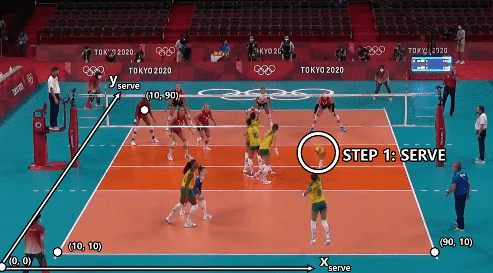
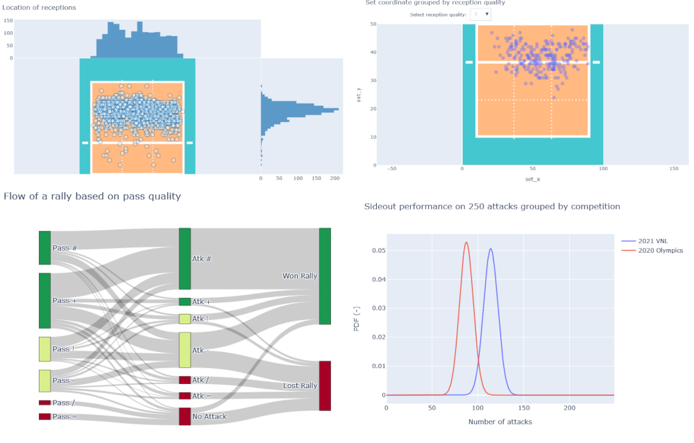
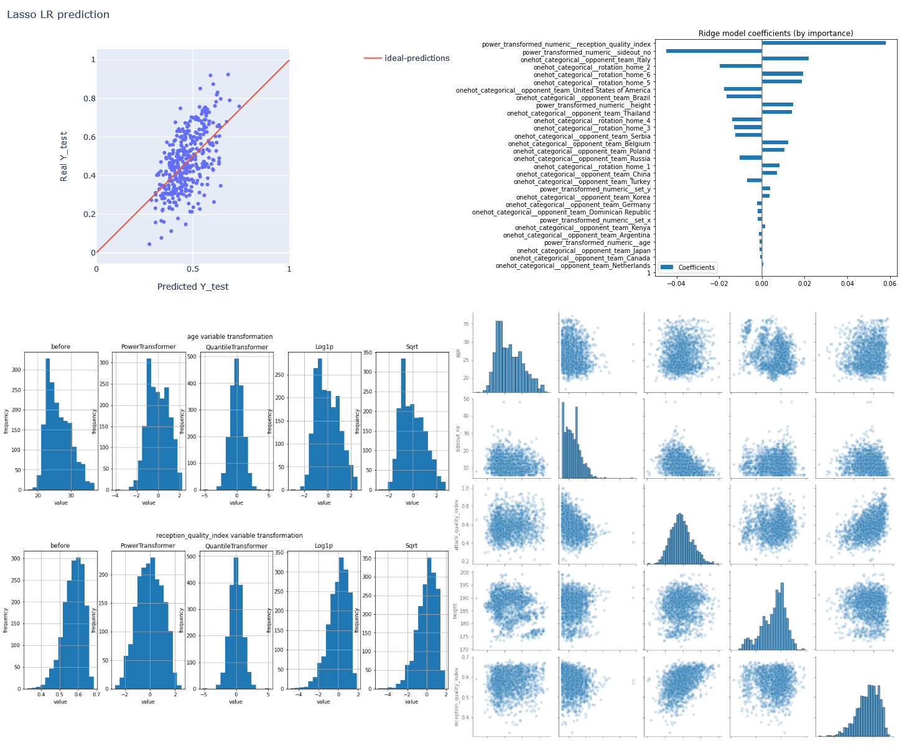
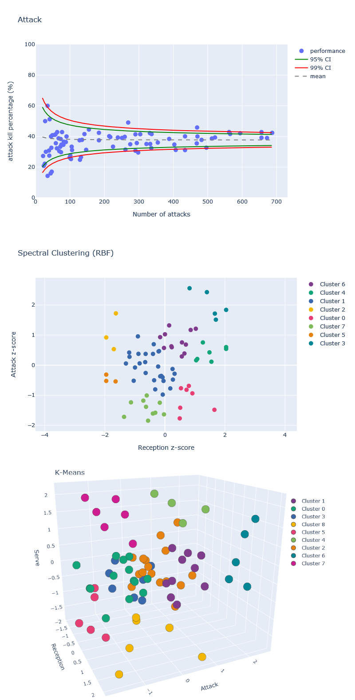

# VolleyballML

***Machine learning, data exploration, and data viz for volleyball data***
https://www.volleydataverse.com/

 

The project adds a more scientific spin to the classical analyses of volleyball statistical data, trying to add to a *descriptive* approach some novel **predictive** and **interpretative** approaches.
The goal of the project is to take more **data-driven decisions**, find non-trivial **patterns**, and hopefully using that knowledge during volleyball games to **maximize the winning odds**.

The project ***currently*** includes:
- 01_hypothesis_testing: Intro to the dataset and presentation of different solutions for **hypothesis testing**
- 02_linear_regression: With a goal of **interpretation**, use **linear regression models** to evaluate which factors are most important in determining the side-out performance
- 04_clustering_unsupervised: **Clustering** of outside-hitters based on performance

## Volleyball sideout dataset
What is a sideout?

## 01 Hypotesis testing
See the results here: https://www.volleydataverse.com/advanced-analysis/hypothesis-testing
- In the context of the 2021 Summer Season, data from the USA National Team was used to **prove (and disprove) some hypotheses** in  a strict statistical sense
- The work includes a **data exploration** section, that uses both **descriptive statistics** and **interactive visualization** techniques
- Hypothesis testing proceeds from the analysis of a **contingency table**, using **Binomial test**, **Chi-square test**, and **Fisher's exact test** to investigate null and alternative hypotheses
- This work was developed with *Python* in a **Jupyter Notebook**, using **Pandas** as a framework for most operations, **Plotly** and Seaborn as visualization libraries
- 

## 02 Linear regression
See the results here: https://www.volleydataverse.com/advanced-analysis/linear-regression-ml
- In the context of the 2021 Summer Season, data from the 2020 Tokyo Olympics and 2021 Volleyball Nations League was used in linear regression machine learning models to evaluate the *importance of different features on team's attack quality*. The models are hence more targeted to ***interpretation*** of the observed data rather than prediction
- The work includes a *data exploration* section, that uses both *descriptive statistics* and *visualization* techniques, with a **correlation analysis**
- It follows a **data engineering** and **data preparation using a pipeline** for the **machine learning** linear regression models
- Results from linear regression models (**linear regression**, **Ridge** regression, **Lasso** regression, **ElasticNet** regression) are compared, including *polynomial features* 
- An *80-20 training-test split* is used, with  **k-fold validation** (10-folds) and **GridSearchCV** to find the appropriate regularization hyperparameter/s when appropriate
- This work was developed with *Python* in a *Jupyter Notebook*, using Pandas and **scikit-learn**, with *Plotly* and Seaborn as visualization libraries
  

## 04 Clustering (unsupervised)
See the results here: https://www.volleydataverse.com/advanced-analysis/clustering-ml
- In the context of the 2021 Summer Season, data from the 2020 Tokyo Olympics and 2021 Volleyball Nations League was used with several clustering algorithms to **group outside hitters based on their attack, reception, and serve performances**
- The work includes a **standardization of the performance indexes** to compare players with different amount of data available
- Results from **several clustering models (K-Means, Agglomerative Clustering, Spectral Clustering, DBSCAN, Mean Shift)** are displayed for a 2-feature and 3-feeature analysis (with same weight)
  - This work was developed with *Python* in a *Jupyter Notebook*, using Pandas and **scikit-learn**, with *Plotly* as visualization library
    

